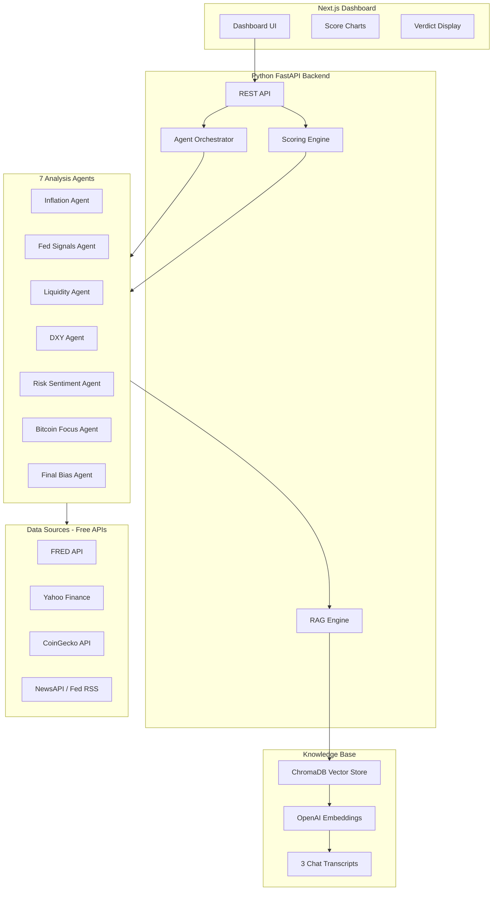

# BTC Macro AI Agentic System — Implementation Plan

> Build a full-stack AI agentic system with a Python FastAPI backend (LangChain + RAG + OpenAI) and a Next.js dashboard frontend that auto-fetches macro data, analyzes it through 7 checklist sections using the knowledge base, and produces a daily BTC verdict with a 0-100 score.

---

## Architecture Diagram



---

## Project Structure

```
Crypto/
├── backend/                        # Python FastAPI + LangChain
│   ├── main.py                     # FastAPI app entry point
│   ├── requirements.txt            # Python dependencies
│   ├── .env                        # API keys (OPENAI, FRED, NEWS)
│   │
│   ├── knowledge_base/             # Raw text of the 3 conversations
│   │   ├── chat1_money_rotation.txt
│   │   ├── chat2_btc_macro_analysis.txt
│   │   └── chat3_macro_geopolitics.txt
│   │
│   ├── rag/
│   │   ├── ingest.py               # Chunk + embed + store in ChromaDB
│   │   └── retriever.py            # Query the vector store
│   │
│   ├── data_fetchers/
│   │   ├── fred_data.py            # CPI, PCE, yields, balance sheet
│   │   ├── yahoo_data.py           # DXY, VIX, S&P 500, Gold
│   │   ├── coingecko_data.py       # BTC price, dominance, stablecoins
│   │   └── news_data.py            # Fed speeches, macro headlines
│   │
│   ├── agents/
│   │   ├── orchestrator.py         # Runs all 7 agents in sequence
│   │   ├── inflation_agent.py      # Section 1: Inflation & Economy
│   │   ├── fed_signals_agent.py    # Section 2: Federal Reserve
│   │   ├── liquidity_agent.py      # Section 3: Liquidity & Bonds
│   │   ├── dxy_agent.py            # Section 4: US Dollar
│   │   ├── risk_agent.py           # Section 5: Risk Sentiment
│   │   ├── bitcoin_agent.py        # Section 6: Bitcoin Focus
│   │   └── verdict_agent.py        # Section 7: Final Bias (0-100)
│   │
│   └── models/
│       └── schemas.py              # Pydantic models for scores/verdicts
│
├── frontend/                       # Next.js dashboard
│   ├── package.json
│   ├── app/
│   │   ├── layout.tsx
│   │   ├── page.tsx                # Main dashboard page
│   │   └── api/                    # Proxy to backend if needed
│   ├── components/
│   │   ├── ScoreCard.tsx           # Individual section score card
│   │   ├── VerdictPanel.tsx        # Final bias display
│   │   ├── MacroChecklist.tsx      # 7-section checklist view
│   │   ├── ScoreGauge.tsx          # 0-100 gauge visualization
│   │   └── Header.tsx
│   └── lib/
│       └── api.ts                  # Fetch from backend
│
├── Daily_Bitcoin_Macro_Checklist.md # Reference doc (already exists)
├── IMPLEMENTATION_PLAN.md           # This file
└── README.md                        # Project overview
```

---

## Tech Stack

| Layer | Technology | Purpose |
|-------|-----------|---------|
| LLM | OpenAI GPT-4o | Reasoning + analysis engine |
| Embeddings | OpenAI text-embedding-3-small | Document embeddings for RAG |
| Vector DB | ChromaDB (local) | Store/query knowledge base |
| RAG Framework | LangChain | Agent orchestration + retrieval |
| Backend | FastAPI (Python) | REST API server |
| Data: Macro | FRED API (free key) | CPI, PCE, yields, Fed balance sheet |
| Data: Markets | yfinance (no key needed) | DXY, VIX, S&P 500, Gold |
| Data: Crypto | CoinGecko (free, no key) | BTC price, dominance, stablecoin cap |
| Data: News | NewsAPI (free tier) | Fed speeches, macro headlines |
| Frontend | Next.js 14 + Tailwind + shadcn/ui | Dashboard UI |

---

## Agent Workflow (Per Analysis Run)

Each of the 7 agents follows the same pattern:

1. **Fetch** — Pull relevant real-time data from APIs
2. **Retrieve** — Query RAG knowledge base for the scoring framework
3. **Analyze** — Use GPT-4o to evaluate current data against the framework
4. **Score** — Assign a section score (0–100) with reasoning
5. **Return** — Structured JSON output (score, reasoning, signals, raw data)

### Verdict Agent (Final Step)

Aggregates all 6 section scores using the weighted formula from the knowledge base:

| Component | Weight |
|-----------|--------|
| Inflation Trend | 20% |
| Fed Policy Direction | 25% |
| Liquidity Conditions | 20% |
| Dollar Strength (DXY) | 20% |
| Risk Environment | 15% |

Then maps the total score to a bias and action:

| Score Range | BTC Bias | Strategy |
|-------------|----------|----------|
| 80–100 | Strong Bull | Aggressive BTC accumulation |
| 60–79 | Bullish | Hold + add on dips |
| 40–59 | Neutral | Small positions only |
| 20–39 | Bearish | Capital protection |
| 0–19 | High Risk | Stay out / hedge |

---

## API Endpoints

| Endpoint | Method | Description |
|----------|--------|-------------|
| `/api/analyze` | POST | Run full 7-section analysis, return all scores + verdict |
| `/api/analyze/{section}` | GET | Run a single section analysis |
| `/api/history` | GET | Get past analysis results |
| `/api/health` | GET | System health check |

---

## Data Source Mapping

| Checklist Section | Data Sources | Key Metrics |
|-------------------|-------------|-------------|
| 1. Inflation & Economy | FRED | CPI MoM, PCE, PMI, GDP, Oil price |
| 2. Fed Signals | NewsAPI, Fed RSS | Latest Fed speech keywords, rate expectations |
| 3. Liquidity & Bonds | FRED, yfinance | 2Y/10Y yields, yield curve spread, Fed balance sheet |
| 4. US Dollar (DXY) | yfinance | DXY price, 7D/30D trend, BTC-DXY correlation |
| 5. Risk Sentiment | yfinance | VIX level, S&P 500 trend, Gold price |
| 6. Bitcoin Focus | CoinGecko | BTC price, dominance, stablecoin cap, ETH/BTC ratio |
| 7. Final Bias | All above | Weighted score 0–100, decision matrix lookup |

---

## Key Implementation Details

### Knowledge Base (RAG)
- The 3 ChatGPT conversations are saved as `.txt` files in `backend/knowledge_base/`
- Chunked into ~1000 token segments with 200 token overlap
- Embedded using OpenAI `text-embedding-3-small`
- Stored in a local ChromaDB instance (no cloud vector DB needed)
- Each agent queries relevant chunks to get the scoring framework and analysis rules

### Agent Design
- Each agent uses a LangChain `RetrievalQA` chain
- The chain first retrieves relevant knowledge base chunks, then combines them with live market data
- GPT-4o produces a structured analysis with a numeric score and reasoning
- All agents return Pydantic models ensuring consistent JSON for the frontend

### Frontend Dashboard
- Clean, modern UI with 7 score cards (one per section, matching the checklist image)
- Central gauge visualization for the 0–100 macro score
- Verdict banner showing Bullish / Neutral / Bearish with color coding
- "Run Analysis" button to trigger a fresh analysis on demand
- History view showing past verdicts

### API Keys Required

| Key | Where to Get | Cost |
|-----|-------------|------|
| OpenAI API Key | [platform.openai.com](https://platform.openai.com) | Pay-per-use |
| FRED API Key | [fred.stlouisfed.org](https://fred.stlouisfed.org/docs/api/api_key.html) | Free |
| NewsAPI Key | [newsapi.org](https://newsapi.org) | Free tier (100 req/day) |
| yfinance | No key needed | Free |
| CoinGecko | No key needed | Free |

---

## Implementation Order

### Phase 1: Foundation

| Step | Task | Dependencies |
|------|------|-------------|
| 1 | Set up project structure, Python venv, install dependencies | None |
| 2 | Save the 3 chat transcripts as `.txt` files | None |
| 3 | Build RAG pipeline (chunk, embed, store in ChromaDB) | Step 1, 2 |
| 4 | Define Pydantic schemas for scores and verdicts | Step 1 |

### Phase 2: Data & Agents

| Step | Task | Dependencies |
|------|------|-------------|
| 5 | Build FRED data fetcher (CPI, PCE, yields, balance sheet) | Step 1 |
| 6 | Build Yahoo Finance data fetcher (DXY, VIX, S&P 500, Gold) | Step 1 |
| 7 | Build CoinGecko data fetcher (BTC price, dominance, stablecoins) | Step 1 |
| 8 | Build NewsAPI data fetcher (Fed speeches, macro headlines) | Step 1 |
| 9 | Build the 7 analysis agents using LangChain + RAG | Step 3, 4, 5–8 |
| 10 | Build the orchestrator to run all 7 agents in sequence | Step 9 |

### Phase 3: API & Frontend

| Step | Task | Dependencies |
|------|------|-------------|
| 11 | Build FastAPI server with `/api/analyze` endpoint | Step 10 |
| 12 | Build Next.js dashboard with score cards, gauge, verdict panel | Step 11 |
| 13 | End-to-end integration test | Step 12 |

---

## Sample Output (What the Dashboard Produces)

```json
{
  "timestamp": "2026-02-09T14:30:00Z",
  "sections": [
    {
      "name": "Inflation & Economy",
      "score": 65,
      "signals": ["CPI MoM falling", "Oil stable", "PMI above 50"],
      "reasoning": "Inflation trending down but still above target. Growth stable."
    },
    {
      "name": "Federal Reserve Signals",
      "score": 70,
      "signals": ["Fed said 'data dependent'", "Rate cut expectations rising"],
      "reasoning": "Dovish tone detected. Multiple pivot signal keywords found."
    },
    {
      "name": "Liquidity & Bonds",
      "score": 55,
      "signals": ["10Y yield falling", "Yield curve steepening"],
      "reasoning": "Liquidity conditions improving but not yet expansive."
    },
    {
      "name": "US Dollar (DXY)",
      "score": 60,
      "signals": ["DXY weakening 7D trend", "Negative BTC-DXY correlation"],
      "reasoning": "Dollar showing weakness, favorable for BTC."
    },
    {
      "name": "Risk Sentiment",
      "score": 58,
      "signals": ["VIX at 18", "S&P 500 near highs", "Gold stable"],
      "reasoning": "Mixed risk environment. Equities strong but caution present."
    },
    {
      "name": "Bitcoin Focus",
      "score": 72,
      "signals": ["BTC above 200 DMA", "BTC dominance rising", "Stablecoin inflow"],
      "reasoning": "BTC structure bullish. Outperforming stocks. Accumulation signals."
    }
  ],
  "final_score": 63,
  "bias": "Bullish",
  "action": "Hold + add on dips",
  "confidence": "Medium-High",
  "summary": "Macro conditions favor BTC. Fed pivoting dovish, dollar weakening, BTC structure strong. Score 63/100 = Bullish bias."
}
```

---

## Golden Rules (From Knowledge Base)

1. **Bitcoin is a global liquidity thermometer** — not a tech stock, not a currency
2. **Money rotates BEFORE economic data confirms** — smart money moves early
3. **BTC bottoms during policy confusion, tops during policy comfort**
4. **Never wait for confirmation from news** — by the time headlines change, rotation is done
5. **If liquidity improves, BTC will eventually explode**

---

## Next Steps

Once you confirm this plan, implementation begins in this order:
1. Project setup + dependencies
2. Knowledge base + RAG pipeline
3. Data fetchers (all 4 in parallel)
4. 7 analysis agents
5. FastAPI server
6. Next.js dashboard
7. End-to-end testing

